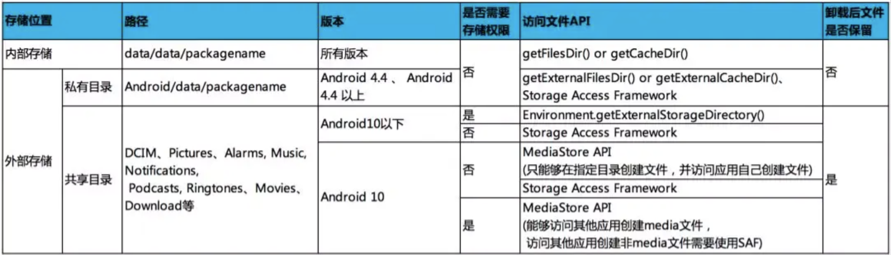

# android Q沙盒适配

Android Q文件存储机制修改成了沙盒模式

应用只能访问自己沙盒下的文件和公共媒体文件
存储（也就是write）私有目录和公共媒体文件都不需要WRITE_EXTERNAL_STORAGE权限
读取 （也就是read）私有目录不需要READ_EXTERNAL_STORAGE权限，读取公共媒体文件需要READ_EXTERNAL_STORAGE权限。

也就是说只能访问

1.自己沙盒
getExternalFilesDir（这是APP自身目录下的文件夹 （Android/data/包名/fils））
（1）APP 卸载在这里插入代码片后，数据会清除。
（2）APP 访问自己的 App-specific 目录时无需任何权限。
（3）可以使用FileProvider分享使用自己私有目录的文件。
所以在沙盒化的Q系统下，私有目录下的文件会跟随APP卸载而删除。在其目录内部的文件操作和Q之前的版本一样，可以随意处理。

2.公共媒体文件
公有目录：Downloads、Documents、Pictures 、DCIM、Movies、Music、Ringtones等
地址：/storage/emulated/0/Downloads(Pictures)等
（1）公共目录下的文件在 APP 卸载后，不会删除。
（2）APP 可以通过 SAF框架(System Access Framework)、MediaStore 接口访问其中的文件。
（3）无法直接使用路径访问公共目录文件。
由于公共目录没有办法直接访问和处理文件，所以我们需要按照Android Q的新规则来进行文件的处理，要使用到ContentResolver 和MediaStore数据库和Cursor 来进行查询等

参考链接：[Android 10 分区存储介绍及百度APP适配实践](https://juejin.cn/post/6844904063432130568#heading-29)
